| Berliana Noviansyah  |      312010373    |
|----------------------|-------------------|
|       TI.20.A1       |  Pemrograman Web  |
|      Pertemuan 9     |    Praktikum 7    |


## 1). Installasi Aplikasi Xampp


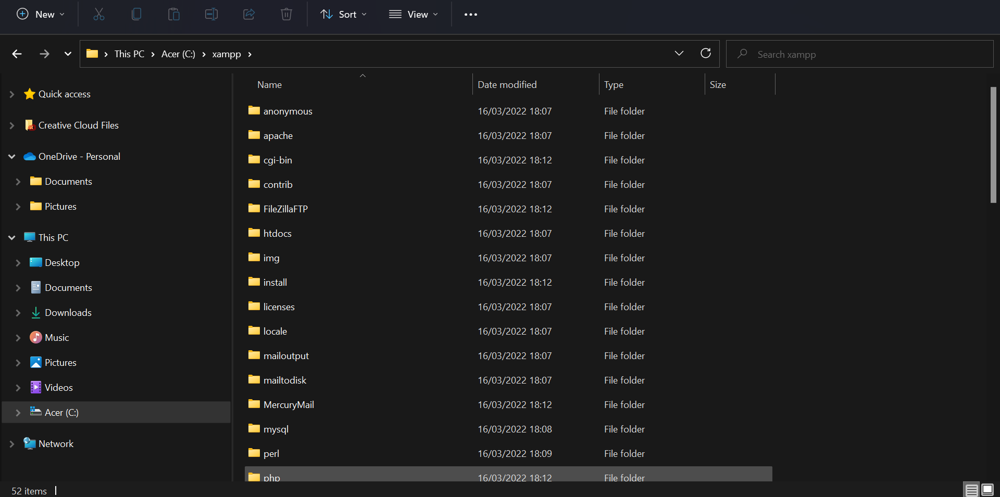


Pertama, install aplikasi Xampp lalu ekstrak filenya sesuaikan dengan tempat tersimpannya file tersebut. 


## 2). Menjalankan Web Server


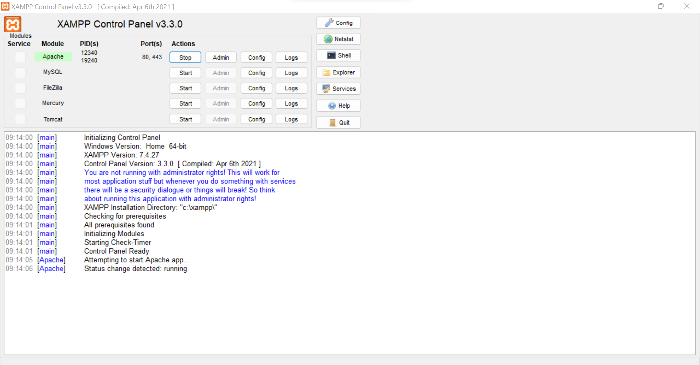


Selanjutnya aktifkan Xampp dengan menekan tombol **start server apache** seperti gambar di atas.


## 3). Memulai PHP

Buat folder lab7_php_dasar pada root directory web server (c:xampp\htdocs)


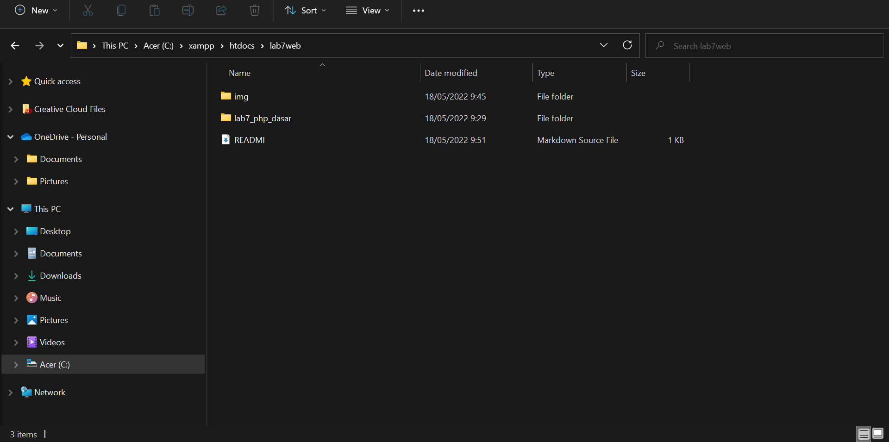


Lalu buat golder dengan nama **lab7_php_dasar** yang disimpan didalam folder **lab7web** untuk repository.
Kemudian akses directory pada web server dengan mengakses URL:http://localhost/lab7web/lab7_php_dasar/


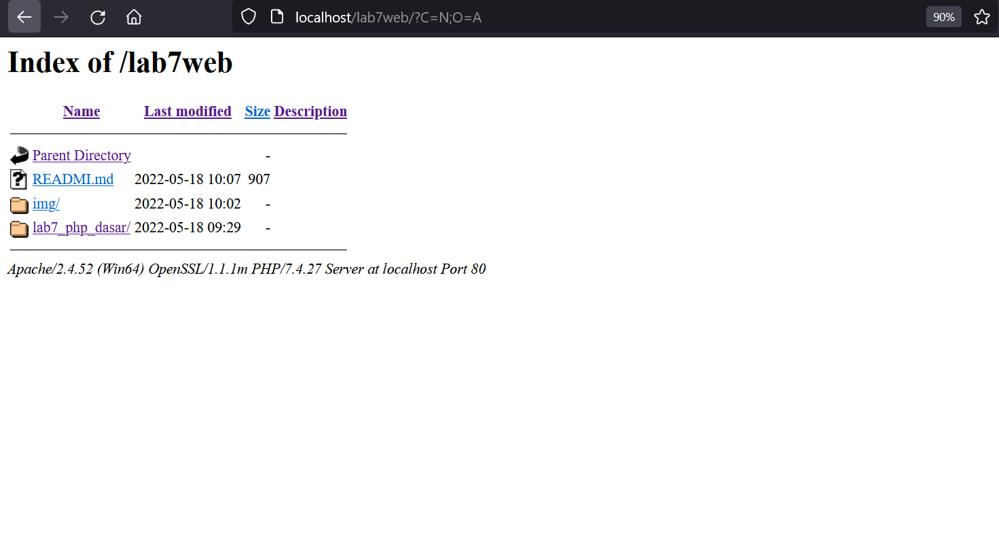


## 4). PHP Dasar

Buatlah file di dalam folder **lab7_php_dasar** dengan nama **php_dasar.php**

Kemudian buat kode seperti ini: 

```html
<<!DOCTYPE html>
<html lang="en">
<head>
    <meta charset="UTF-8">
    <title>PHP Dasar</title>
</head>
<body>
    <h1>Belajar PHP Dasar</h1>
    <?php
        echo "Hello World";
    ?>
</body>
</html>
```

Lalu akses hasilnya melalui URL:http://localhost/lab7web/lab7_php_dasar/php_dasar.php/

Outputnya:

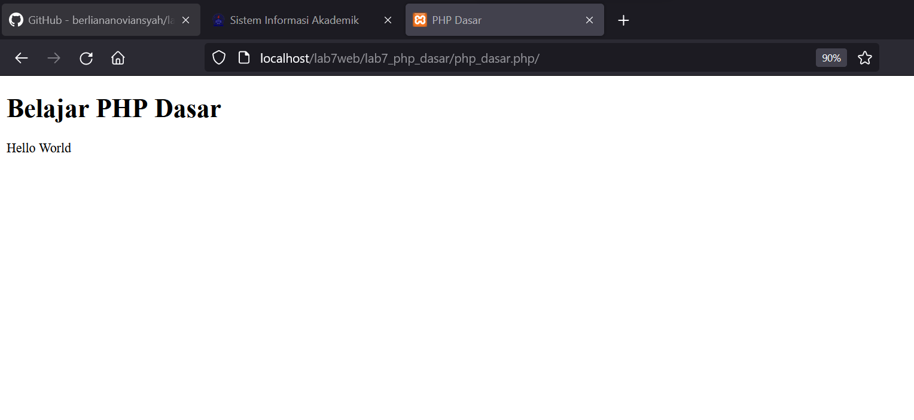


## 5). Variable PHP

Masukan codingan dibawah ini pada file php_dasar.php

```php
<h2>Menggunakan Variabel</h2>
    <?php
        $nim = "312010373";
        $nama = 'Berliana Noviansyah';
        echo "NIM : " . $nim . "<br>";
        echo "Nama : $nama";
    ?>
```

Buka dengan URL: http://localhost/lab7web/lab7_php_dasar/php_dasar.php/

Dan didapatkan hasil:


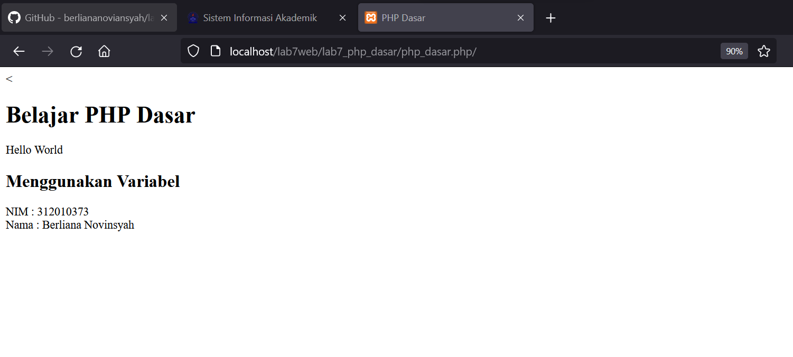


## 6). Predefine Variable $_GET

Buat Codingan sebagai berikut :

```php
<?php
echo 'Selamat Datang ' . $_GET['nama'];
?>
```
Dan akses URL:http://localhost/lab7web/lab7_php_dasar/latihan2.php?nama=Berliana%20Noviansyah.


Lalu didapatkan hasil sebagai berikut:
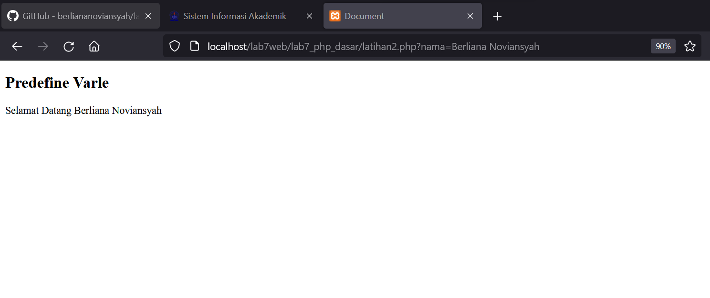


## 7). Membuat Form Input

```php
!DOCTYPE html>
<html lang="en">
<head>
    <meta charset="UTF-8">
    <meta http-equiv="X-UA-Compatible" content="IE=edge">
    <meta name="viewport" content="width=device-width, initial-scale=1.0">
    <title>PHP Dasar</title>
</head>
<body>
    <h2>Form Input</h2>
    <form method="post">
        <label for="Nama">Nama: </label>
        <input type="text" name="nama">
        <input type="submit" value="Kirim">
    </form>
    <?php
        echo 'Selamat Datang ' . $_POST['nama'];
    ?>
</body>
</html>
```

Untuk mengakses web tersebut, masukkan URL:http://localhost/lab7web/lab7_php_dasar/latihan3.php


Lalu isi nama yang telah dimasukkan pada bagian sebelumnya, klik kirim.

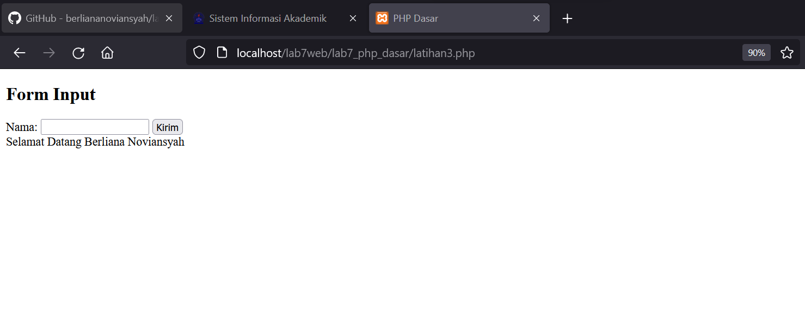


## 8). Operator

Masukan codingan seperti dibawah ini:

```php
<!DOCTYPE html>
<html lang="en">
<head>
    <meta charset="UTF-8">
    <meta http-equiv="X-UA-Compatible" content="IE=edge">
    <meta name="viewport" content="width=device-width, initial-scale=1.0">
    <title>Document</title>
</head>
<body>
    <h2>Operator</h2>
    <?php
        $gaji = 1500000;
        $pajak = 0.1;
        $thp = $gaji - ($gaji*$pajak);
        echo "Gaji sebelum pajak = Rp. $gaji <br>";
        echo "Gaji yang dibawa pulang = Rp. $thp";
    ?>
</body>
</html>
```


Lalu akses URL:http://localhost/lab7web/lab7_php_dasar/operator.php


Dan tampilannya adalah sebagai berikut:

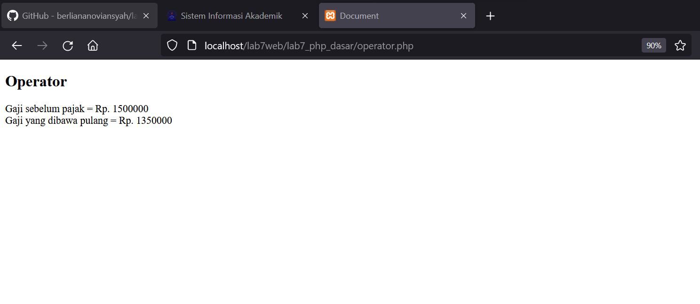


## 9). Kondisi IF


```php
<!DOCTYPE html>
<html lang="en">
<head>
    <meta charset="UTF-8">
    <meta http-equiv="X-UA-Compatible" content="IE=edge">
    <meta name="viewport" content="width=device-width, initial-scale=1.0">
    <title>Document</title>
</head>
<body>
    <h2>Kondisi IF</h2>
    <?php
        $nama_hari = date("l");
        if ($nama_hari == "Sunday") {
            echo "Minggu";
        } elseif ($nama_hari == "Monday") {
            echo "Senin";
        } else {
            echo "Selasa";
        }
    ?>
</body>
</html>
```


Akses URL:http://localhost/lab7web/lab7_php_dasar/kondisi.php


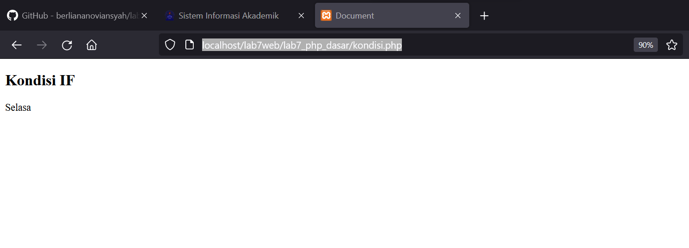


## 10). Kondisi SWITCH

```php
<!-- Kondisi Switch -->
    <h2>Kondisi Switch</h2>
    <?php
        $nama_hari = date("l");
        switch ($nama_hari) {
            case "Sunday":
                 echo "Minggu";
                 break;
            case "Monday":
                echo "Senin";
                break;
             case "Tuesday":
                 echo "Selasa";
                break;
            default:
                echo "Sabtu"; 
            }
            echo "/$nama_hari";
    ?>
</body>
</html>
```


Akses URL: http://localhost/lab7web/lab7_php_dasar/kondisi.php


Dan tampilannya sebagai berikut:

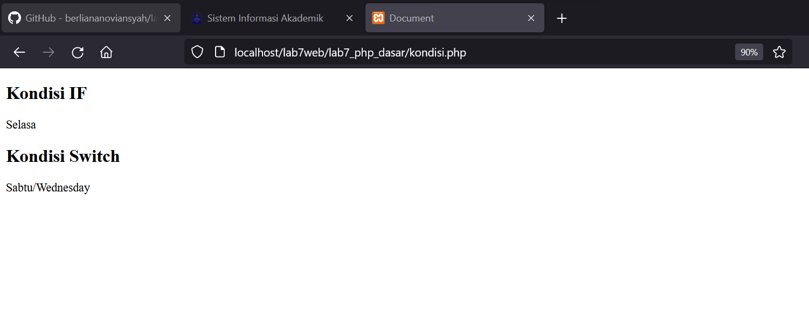


