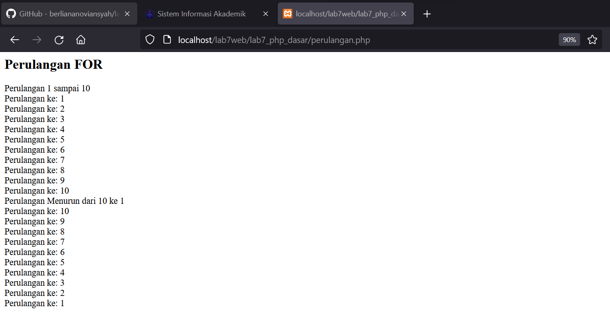
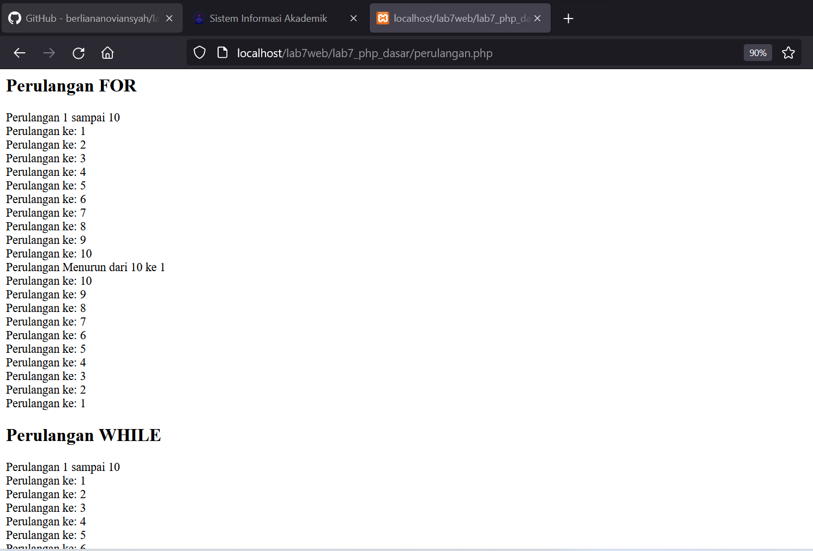
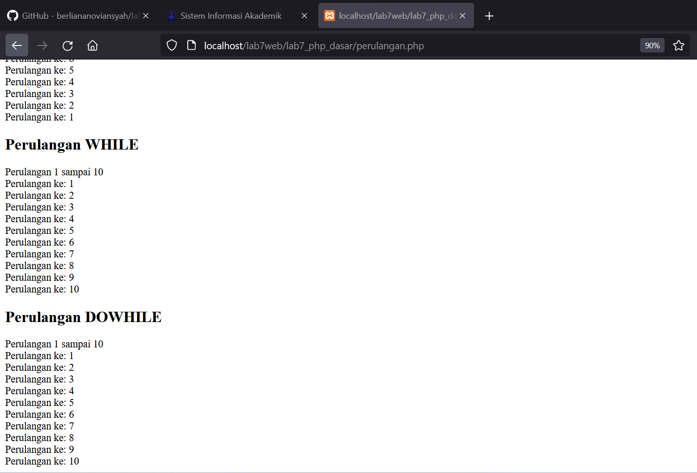
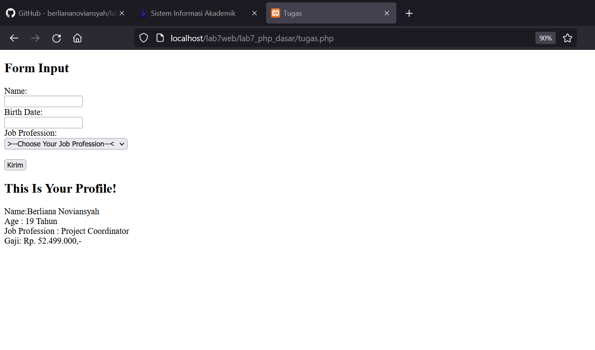

| Berliana Noviansyah  |      312010373    |
|----------------------|-------------------|
|       TI.20.A1       |  Pemrograman Web  |
|      Pertemuan 9     |    Praktikum 7    |


## 1). Installasi Aplikasi Xampp


Pertama, install aplikasi Xampp lalu ekstrak filenya sesuaikan dengan tempat tersimpannya file tersebut. 


## 2). Menjalankan Web Server


Selanjutnya aktifkan Xampp dengan menekan tombol **start server apache** seperti gambar di atas.


## 3). Memulai PHP

Buat folder lab7_php_dasar pada root directory web server (c:xampp\htdocs)


Lalu buat golder dengan nama **lab7_php_dasar** yang disimpan didalam folder **lab7web** untuk repository.
Kemudian akses directory pada web server dengan mengakses URL:http://localhost/lab7web/lab7_php_dasar/


## 4). PHP Dasar

Buatlah file di dalam folder **lab7_php_dasar** dengan nama **php_dasar.php**

Kemudian buat kode seperti ini: 

```html
<<!DOCTYPE html>
<html lang="en">
<head>
    <meta charset="UTF-8">
    <title>PHP Dasar</title>
</head>
<body>
    <h1>Belajar PHP Dasar</h1>
    <?php
        echo "Hello World";
    ?>
</body>
</html>
```

Lalu akses hasilnya melalui URL:http://localhost/lab7web/lab7_php_dasar/php_dasar.php/

Outputnya:


## 5). Variable PHP

Masukan codingan dibawah ini pada file php_dasar.php

```php
<h2>Menggunakan Variabel</h2>
    <?php
        $nim = "312010373";
        $nama = 'Berliana Noviansyah';
        echo "NIM : " . $nim . "<br>";
        echo "Nama : $nama";
    ?>
```

Buka dengan URL: http://localhost/lab7web/lab7_php_dasar/php_dasar.php/

Dan didapatkan hasil:


## 6). Predefine Variable $_GET

Buat Codingan sebagai berikut :

```php
<?php
echo 'Selamat Datang ' . $_GET['nama'];
?>
```
Dan akses URL:http://localhost/lab7web/lab7_php_dasar/latihan2.php?nama=Berliana%20Noviansyah.


Lalu didapatkan hasil sebagai berikut:


## 7). Membuat Form Input

```php
!DOCTYPE html>
<html lang="en">
<head>
    <meta charset="UTF-8">
    <meta http-equiv="X-UA-Compatible" content="IE=edge">
    <meta name="viewport" content="width=device-width, initial-scale=1.0">
    <title>PHP Dasar</title>
</head>
<body>
    <h2>Form Input</h2>
    <form method="post">
        <label for="Nama">Nama: </label>
        <input type="text" name="nama">
        <input type="submit" value="Kirim">
    </form>
    <?php
        echo 'Selamat Datang ' . $_POST['nama'];
    ?>
</body>
</html>
```

Untuk mengakses web tersebut, masukkan URL:http://localhost/lab7web/lab7_php_dasar/latihan3.php


Lalu isi nama yang telah dimasukkan pada bagian sebelumnya, klik kirim.


## 8). Operator

Masukan codingan seperti dibawah ini:

```php
<!DOCTYPE html>
<html lang="en">
<head>
    <meta charset="UTF-8">
    <meta http-equiv="X-UA-Compatible" content="IE=edge">
    <meta name="viewport" content="width=device-width, initial-scale=1.0">
    <title>Document</title>
</head>
<body>
    <h2>Operator</h2>
    <?php
        $gaji = 1500000;
        $pajak = 0.1;
        $thp = $gaji - ($gaji*$pajak);
        echo "Gaji sebelum pajak = Rp. $gaji <br>";
        echo "Gaji yang dibawa pulang = Rp. $thp";
    ?>
</body>
</html>
```


Lalu akses URL:http://localhost/lab7web/lab7_php_dasar/operator.php


Dan tampilannya adalah sebagai berikut:


## 9). Kondisi IF


```php
<!DOCTYPE html>
<html lang="en">
<head>
    <meta charset="UTF-8">
    <meta http-equiv="X-UA-Compatible" content="IE=edge">
    <meta name="viewport" content="width=device-width, initial-scale=1.0">
    <title>Document</title>
</head>
<body>
    <h2>Kondisi IF</h2>
    <?php
        $nama_hari = date("l");
        if ($nama_hari == "Sunday") {
            echo "Minggu";
        } elseif ($nama_hari == "Monday") {
            echo "Senin";
        } else {
            echo "Selasa";
        }
    ?>
</body>
</html>
```


Akses URL:http://localhost/lab7web/lab7_php_dasar/kondisi.php


## 10). Kondisi SWITCH

```php
<!-- Kondisi Switch -->
    <h2>Kondisi Switch</h2>
    <?php
        $nama_hari = date("l");
        switch ($nama_hari) {
            case "Sunday":
                 echo "Minggu";
                 break;
            case "Monday":
                echo "Senin";
                break;
             case "Tuesday":
                 echo "Selasa";
                break;
            default:
                echo "Sabtu"; 
            }
            echo "/$nama_hari";
    ?>
</body>
</html>
```


Akses URL: http://localhost/lab7web/lab7_php_dasar/kondisi.php


Dan tampilannya sebagai berikut:


## 11). Perulangan FOR


Buat codingan seperti dibawah ini pada file **perulangan.php**

```php
<h2>Perulangan FOR</h2>
    <?php
        echo "Perulangan 1 sampai 10 <br />";
        for ($i=1; $i<=10; $i++) {
            echo "Perulangan ke: " . $i . '<br />';
}
        echo "Perulangan Menurun dari 10 ke 1 <br />";
        for ($i=10; $i>=1; $i--) {
            echo "Perulangan ke: " . $i . '<br />';
}
?>
```


Lalu akses dengan URL berikut:
http://localhost/lab7web/lab7_php_dasar/perulangan.php


Dengan output sebagai berikut:





## 12). Perulangan WHILE


```php
<!-- Perulangan While -->
<h2>Perulangan WHILE</h2>
<?php
    echo "Perulangan 1 sampai 10 <br />";
    $i=1;
    while ($i<=10) {
        echo "Perulangan ke: " . $i . '<br />';
        $i++;
}
?>
```


Akses URL dengan URL berikut: http://localhost/lab7web/lab7_php_dasar/perulangan.php


Dengan Output sebagai berikut:





## 13). Perulangan DOWHILE


```php
<!-- Perulangan DOWHILE -->
<h2>Perulangan DOWHILE</h2>
<?php
    echo "Perulangan 1 sampai 10 <br />";
    $i=1;
    do {
        echo "Perulangan ke: " . $i . '<br />';
        $i++;
} while ($i<=10);
?>
```


URL: http://localhost/lab7web/lab7_php_dasar/perulangan.php


Tampilan:





## Pertanyaan Dan Tugas!


Buatlah program PHP sederhana dengan menggunakan form input yang menampilkan nama , tanggal lahir dan pekerjaan . Kemudian tampilkan outputnya dengan menghitung umur berdasarkan inputan tanggal lahir . Dan pilihan pekerjaan dengan gaji yang berbeda-beda sesuai pilihan pekerjaan.


Berikut adalah Full coding tugas:


```php
!DOCTYPE html>
<html lang="en">
<head>
    <meta charset="UTF-8">
    <meta http-equiv="X-UA-Compatible" content="IE=edge">
    <meta name="viewport" content="width=device-width, initial-scale=1.0">
    <title>Tugas</title>
</head>
<body>
<h2>Form Input</h2>
    <form method="post">
        <label for="Nama">Name: </label>
        <br>
        <input type="text" name="nama">
        <br>
        <label for="Tanggal Lahir">Birth Date: </label>
        <br>
        <input type="text" name="tanggal_lahir">
        <br>
        <label for="Pekerjaan">Job Profession: </label>
        <br>
        <select name='pekerjaan'>
                <option value="-">>--Choose Your Job Profession--<</option>
                <option value='Project Coordinator'>Project Coordinator</option>
                <option value='Engineering'>Engineering</option>
                <option value='QA/QC'>QA/QC</option>
                <option value='Supervisor1'>Supervisor1</option>
                <option value="Supervisor2">Supervisor2</option>
            </select>
            <br>
            <br>
            <button type="submit">Kirim</button>
    </form>
    <h2>This Is Your Profile!</h2>
    <?php
        echo 'Name:' . $_POST['nama'];

        # Merubah Tanggal Lahir menjadi Umur (Tahun)
        $tanggal_lahir = @$_POST['tanggal_lahir'];

        $lahir = new DateTime($tanggal_lahir);
        $hari_ini = new DateTime();

        $diff = $hari_ini->diff($lahir);

        echo "<br> Age            : ". $diff->y ." Tahun";

        echo "<br> Job Profession : " .$_POST['pekerjaan'];


        # Kondisi if pekerjaan untuk menentukan gaji
        $pekerjaan = @$_POST['pekerjaan'];

        if($pekerjaan == "Project Coordinator"){
            echo '<br> Gaji: Rp. 52.499.000,-';
        }elseif($pekerjaan == "Engineering"){
            echo '<br> Gaji: Rp. 19.800.000,-';
        }elseif($pekerjaan == "QA/QC"){
            echo '<br> Gaji: Rp. 11.250.000,-';
        }elseif($pekerjaan == "Supervisor1"){
            echo '<br> Gaji: Rp. 7.199.000,-';
        }elseif ($pekerjaan == "Supervisor2"){
            echo '<br> Gaji: Rp. 7.000.000,-';
        }


    ?>
    
</body>
</html>
```


Hasil output untuk bagian tugas:



